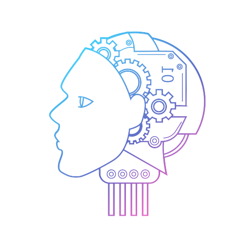

<h1 align="left">Hi there, I'm Michell 👋</h1>

    🏆 Google Summer of Code 2022 contributor

    🎓 Computer Engineer • <a href="https://www.facens.br/" target="_blank">Facens</a>

    💻 Developer Analyst III • <a href="https://cadmus.com.br" target="_blank">Cadmus</a>

    📱 Co-owner of Xtend Code, a mobile app development organization

 
 <h2 align="left">Skills 🔥</h2>
 

    
    
    
    
    
    
    
    
    
    
    
    
    
    
    
    
    

<h2 align="left">Projects 💻</h2>

     <a href="https://play.google.com/store/apps/details?id=com.xtend.vaner" target="_blank">Vaner</a>

    <a href="https://summerofcode.withgoogle.com/programs/2022/projects/8TUw3N9s" target="_blank">SatNOGS Visualization Tool</a>

    <a href="https://github.com/AsteroidsJS-Official" target="_blank">AsteroidsJS</a>

    <a href="https://github.com/paperbook-official" target="_blank">PaperBook</a>

    <a href="https://github.com/iport-official" target="_blank">iPort</a>

<h2 align="left">Stats 📊</h2>

<h3 align="left">Find me in 🌎</h3>

    
    
    

